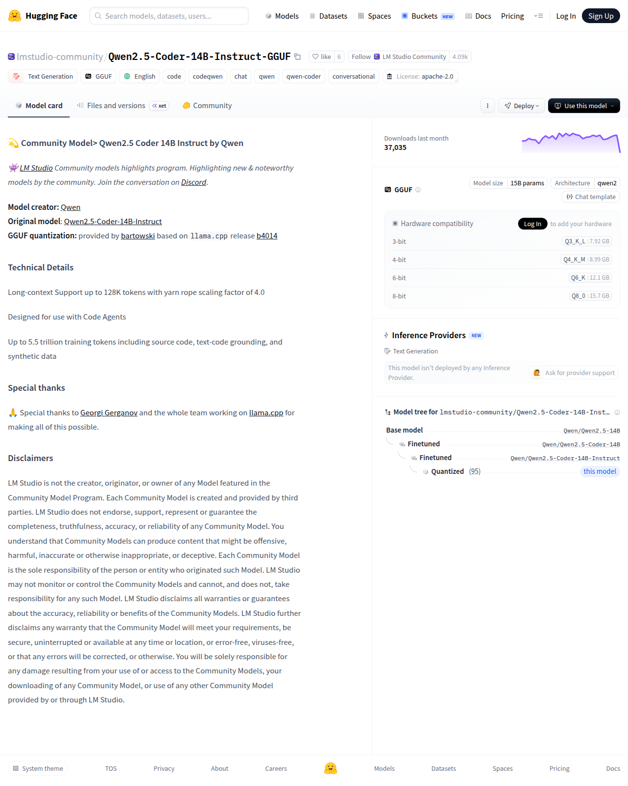

# Visited: https://huggingface.co/lmstudio-community/Qwen2.5-Coder-14B-Instruct-GGUF
**Time:** Thu May  7 14:42:02 UTC 2026

## Screenshot

## Raw HTML
[page.html](./page.html)

## Downloaded Media (1 files)
## Downloaded Media Files

## Other Links
- [#disclaimers](#disclaimers)
- [#special-thanks](#special-thanks)
- [#technical-details](#technical-details)
- [#💫-community-model-qwen25-coder-14b-instruct-by-qwen](#💫-community-model-qwen25-coder-14b-instruct-by-qwen)
- [/](/)
- [/Qwen/Qwen2.5-14B](/Qwen/Qwen2.5-14B)
- [/Qwen/Qwen2.5-Coder-14B](/Qwen/Qwen2.5-Coder-14B)
- [/Qwen/Qwen2.5-Coder-14B-Instruct](/Qwen/Qwen2.5-Coder-14B-Instruct)
- [/datasets](/datasets)
- [/docs](/docs)
- [/docs/hub/model-cards#specifying-a-base-model](/docs/hub/model-cards#specifying-a-base-model)
- [/enterprise](/enterprise)
- [/front/build/kube-87b6ff9/style.css](/front/build/kube-87b6ff9/style.css)
- [/huggingface](/huggingface)
- [/join](/join)
- [/js/script.js](/js/script.js)
- [/lmstudio-community](/lmstudio-community)
- [/lmstudio-community/Qwen2.5-Coder-14B-Instruct-GGUF](/lmstudio-community/Qwen2.5-Coder-14B-Instruct-GGUF)
- [/lmstudio-community/Qwen2.5-Coder-14B-Instruct-GGUF/colab](/lmstudio-community/Qwen2.5-Coder-14B-Instruct-GGUF/colab)
- [/lmstudio-community/Qwen2.5-Coder-14B-Instruct-GGUF/discussions](/lmstudio-community/Qwen2.5-Coder-14B-Instruct-GGUF/discussions)
- [/lmstudio-community/Qwen2.5-Coder-14B-Instruct-GGUF/kaggle](/lmstudio-community/Qwen2.5-Coder-14B-Instruct-GGUF/kaggle)
- [/lmstudio-community/Qwen2.5-Coder-14B-Instruct-GGUF/tree/main](/lmstudio-community/Qwen2.5-Coder-14B-Instruct-GGUF/tree/main)
- [/lmstudio-community/Qwen2.5-Coder-14B-Instruct-GGUF?library=llama-cpp-python](/lmstudio-community/Qwen2.5-Coder-14B-Instruct-GGUF?library=llama-cpp-python)
- [/lmstudio-community/Qwen2.5-Coder-14B-Instruct-GGUF?local-app=docker-model-runner](/lmstudio-community/Qwen2.5-Coder-14B-Instruct-GGUF?local-app=docker-model-runner)
- [/lmstudio-community/Qwen2.5-Coder-14B-Instruct-GGUF?local-app=lemonade](/lmstudio-community/Qwen2.5-Coder-14B-Instruct-GGUF?local-app=lemonade)
- [/lmstudio-community/Qwen2.5-Coder-14B-Instruct-GGUF?local-app=llama.cpp](/lmstudio-community/Qwen2.5-Coder-14B-Instruct-GGUF?local-app=llama.cpp)
- [/lmstudio-community/Qwen2.5-Coder-14B-Instruct-GGUF?local-app=ollama](/lmstudio-community/Qwen2.5-Coder-14B-Instruct-GGUF?local-app=ollama)
- [/lmstudio-community/Qwen2.5-Coder-14B-Instruct-GGUF?local-app=pi](/lmstudio-community/Qwen2.5-Coder-14B-Instruct-GGUF?local-app=pi)
- [/lmstudio-community/Qwen2.5-Coder-14B-Instruct-GGUF?local-app=unsloth](/lmstudio-community/Qwen2.5-Coder-14B-Instruct-GGUF?local-app=unsloth)
- [/lmstudio-community/Qwen2.5-Coder-14B-Instruct-GGUF?local-app=vllm](/lmstudio-community/Qwen2.5-Coder-14B-Instruct-GGUF?local-app=vllm)
- [/login](/login)
- [/models](/models)
- [/models?language=en](/models?language=en)
- [/models?library=gguf](/models?library=gguf)
- [/models?other=base_model:quantized:Qwen/Qwen2.5-Coder-14B-Instruct](/models?other=base_model:quantized:Qwen/Qwen2.5-Coder-14B-Instruct)
- [/models?other=chat](/models?other=chat)
- [/models?other=code](/models?other=code)
- [/models?other=codeqwen](/models?other=codeqwen)
- [/models?other=conversational](/models?other=conversational)
- [/models?other=qwen](/models?other=qwen)
- [/models?other=qwen-coder](/models?other=qwen-coder)
- [/models?pipeline_tag=text-generation](/models?pipeline_tag=text-generation)
- [/pricing](/pricing)
- [/privacy](/privacy)
- [/settings/local-apps#local-apps](/settings/local-apps#local-apps)
- [/spaces](/spaces)
- [/spaces/huggingface/InferenceSupport/discussions/new?title=lmstudio-community/Qwen2.5-Coder-14B-Instruct-GGUF&amp;description=React%20to%20this%20comment%20with%20an%20emoji%20to%20vote%20for%20%5Blmstudio-community%2FQwen2.5-Coder-14B-Instruct-GGUF%5D(%2Flmstudio-community%2FQwen2.5-Coder-14B-Instruct-GGUF)%20to%20be%20supported%20by%20Inference%20Providers.%0A%0A(optional)%20Which%20providers%20are%20you%20interested%20in%3F%20(Novita%2C%20Hyperbolic%2C%20Together%E2%80%A6)%0A](/spaces/huggingface/InferenceSupport/discussions/new?title=lmstudio-community/Qwen2.5-Coder-14B-Instruct-GGUF&amp;description=React%20to%20this%20comment%20with%20an%20emoji%20to%20vote%20for%20%5Blmstudio-community%2FQwen2.5-Coder-14B-Instruct-GGUF%5D(%2Flmstudio-community%2FQwen2.5-Coder-14B-Instruct-GGUF)%20to%20be%20supported%20by%20Inference%20Providers.%0A%0A(optional)%20Which%20providers%20are%20you%20interested%20in%3F%20(Novita%2C%20Hyperbolic%2C%20Together%E2%80%A6)%0A)
- [/storage](/storage)
- [/tasks/text-generation](/tasks/text-generation)
- [/terms-of-service](/terms-of-service)

## Stats
- Links: 71
- Media: 1
